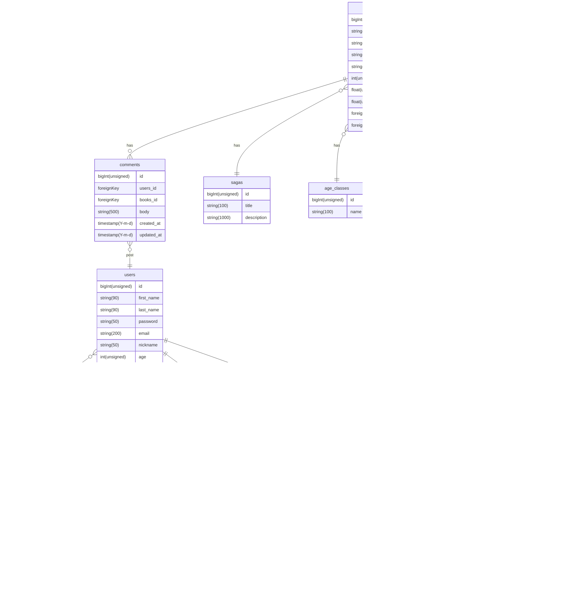

# Schéma BDD

```mermaid
erDiagram
users }o--|| roles : "has"
roles ||--|| permissions : "has"
users ||--o{ adresses: "has"
users ||--o{ payment_methods :  "has"
users ||--o{ orders : "has"
comments }o--|| users : "post"
books ||--o{ comments : "has"
books }o--|| sagas : "has"
books }o--|| age_classes : "has"
books ||--o{ books_has_categories : "has"
books_has_categories }o--||  categories : "has"
books ||--o{ books_has_images : "has"
books_has_images }o--|| images : "has"
orders ||--o{ orders_items : "has"

roles {
bigInt(unsigned) id
string(100) name
}
permissions{
bigInt(unsigned) id
}
users {
bigInt(unsigned) id
string(90) first_name
string(90) last_name
string(50) password
string(200) email
string(50) nickname
int(unsigned) age
string(255) pic_path
foreignKey roles_id
}
adresses {
bigInt(unsigned) id
string(250) adress
bigInt(unsigned) zip_code
foreignKey users_id
}
payment_methods {
bigInt(unsigned) id
string(100) api_id
foreignKey users_id
}
orders {
bigInt(unsigned) id
string(100) order_ref
timestamp(Y-m-d) created_at
date(Y-m-d) delivery_date
string(50) status
}

orders_items {
bigInt(unsigned) id
foreignKey orders_id
int(unsigned)  quantity
float(unsigned) price_wt
bigInt(unsigned) id
string(100) title
}
comments {
bigInt(unsigned) id
foreignKey users_id
foreignKey books_id
string(500) body
timestamp(Y-m-d) created_at
timestamp(Y-m-d) updated_at
}
books{
bigInt(unsigned) id
string(100) title
string(1000) description
string(200) summary
string(50) size
int(unsigned) page_quantity
float(unsigned) price_wt
float(unsigned) weight
foreignKey sagas_id
foreignKey age_classes_id
}
sagas {
bigInt(unsigned) id
string(100) title
string(1000) description
}
age_classes {
bigInt(unsigned) id
string(100) name
}
books_has_categories {
foreignKey books_id
foreignKey categories_id
}
categories {
bigInt(unsigned) id
string(100) name
}
images {
bigInt(unsigned) id
string(100) type
string(255) path
string(100) alt_text
}
books_has_images {
foreignKey books_id
foreignKey images_id
}
```