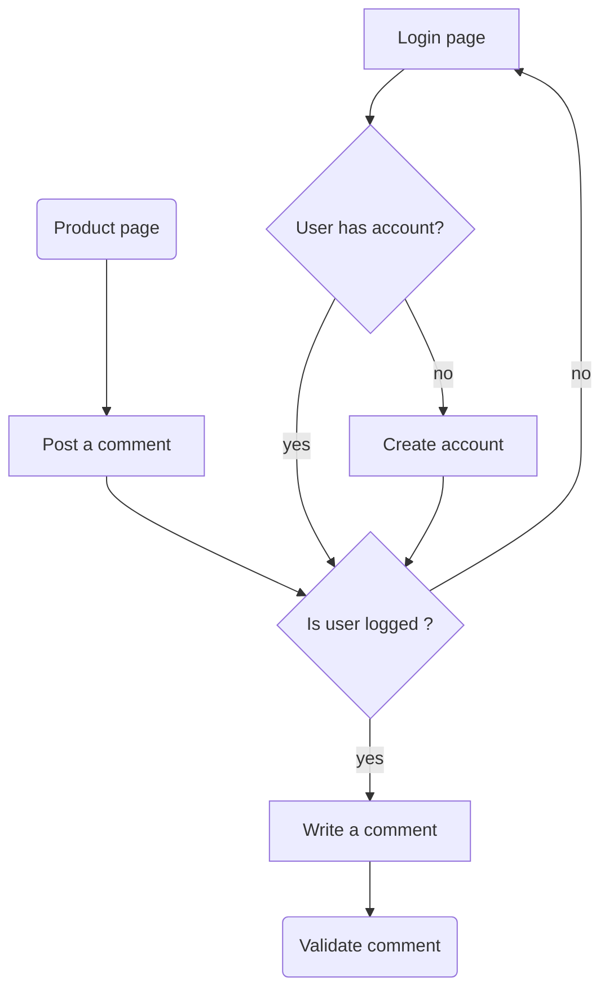
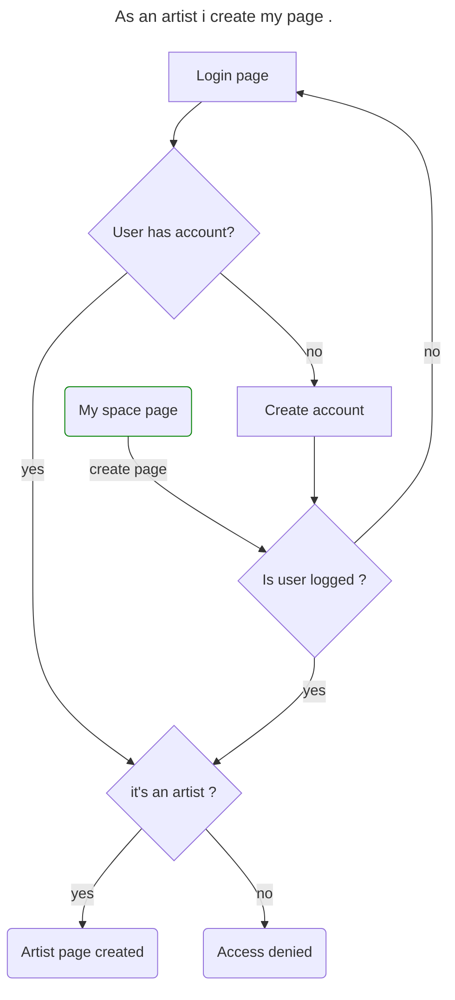
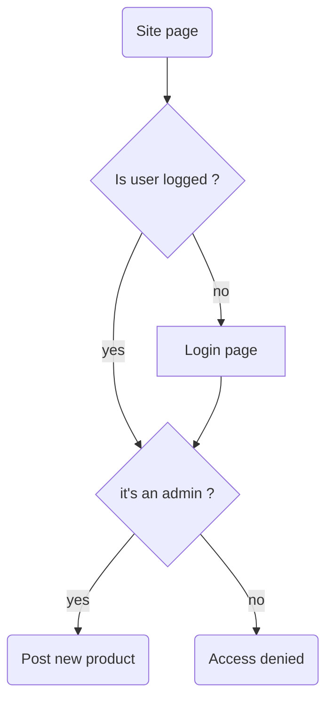
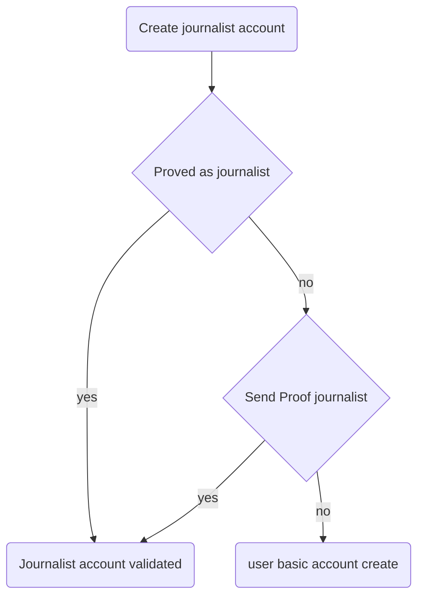
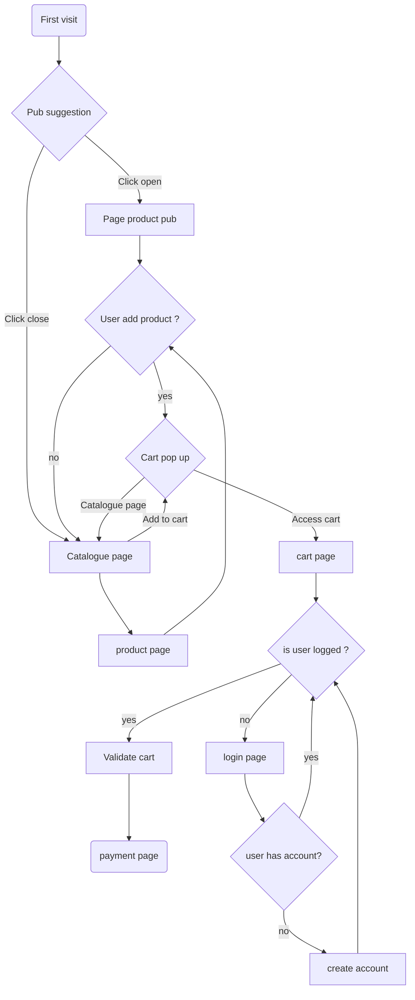

```mermaid
flowchart TB

LOG[Login page]
PRO(Product page)
TESTLOG{Is user logged ?}
TESTACCOUNT{User has account?}
SIGNIN[Create account]
POS[Post a comment]
WAC[Write a comment]
VPS(Validate comment)
	PRO-->POS
	POS-->TESTLOG
	TESTLOG -- no --> LOG
	LOG --> TESTACCOUNT
	TESTACCOUNT -- yes --> TESTLOG
	TESTACCOUNT -- no --> SIGNIN
	SIGNIN --> TESTLOG
	TESTLOG -- yes --> WAC
	WAC --> VPS
```

```mermaid
---
title : As an artist i create my page .
---
flowchart TB

LOG[Login page]
TESTLOG{Is user logged ?}
TESTACCOUNT{User has account?}
SIGNIN[Create account]
CAP(My space page)
TESTART{it's an artist ?}
ACD(Access denied)
APC(Artist page created)
style CAP stroke:green
	CAP-- create page -->TESTLOG
	TESTLOG -- no --> LOG
	TESTLOG -- yes --> TESTART
	LOG --> TESTACCOUNT
	TESTACCOUNT -- yes --> TESTART
	TESTACCOUNT -- no --> SIGNIN
	SIGNIN --> TESTLOG
	TESTART -- yes --> APC
	TESTART -- no --> ACD
	
```

```mermaid
flowchart TB

SI(Site page)
CAP(Post new product)
TESTAD{it's an admin ?}
TESTLOG{Is user logged ?}
LOG[Login page]
ACD(Access denied)
SI --> TESTLOG
TESTLOG -- yes --> TESTAD
TESTLOG -- no --> LOG
LOG --> TESTAD
TESTAD -- 	yes --> CAP
TESTAD -- 	no --> ACD
	
```

```mermaid
flowchart TB

CRE(Create journalist account)
USA(user basic account create)
PAJ{Proved as journalist}
SPP{Send Proof journalist}
JAV(Journalist account validated)

CRE  --> PAJ
PAJ -- yes --> JAV
PAJ -- no -->  SPP
SPP -- yes --> JAV
SPP -- no --> USA
```

```mermaid
flowchart TB

FV(First visit)
PS{Pub suggestion}
PPP[Page product pub]
LOG[login page]
CP[Catalogue page]
PRO[product page]
CAT[cart page]
CPU{Cart pop up}
VAL[Validate cart]
PAY(payment page)
TESTLOG{is user logged ?}
TESTACCOUNT{user has account?}
TESTADD{User add product ?}
SIGNIN[create account]
	
	PRO-->TESTADD
	CAT-->TESTLOG
	TESTLOG -- no --> LOG
	LOG --> TESTACCOUNT
	TESTACCOUNT -- yes --> TESTLOG
	TESTACCOUNT -- no --> SIGNIN
	SIGNIN --> TESTLOG
	TESTLOG -- yes --> VAL
	VAL --> PAY
	FV --> PS
	PS -- Click open --> PPP
	PS -- Click close --> CP
	CP --> PRO
	PPP --> TESTADD
	TESTADD -- yes --> CPU
	TESTADD -- no --> CP
	CPU -- Access cart --> CAT
	CPU -- Catalogue page --> CP
	CP -- Add to cart --> CPU
	
```
